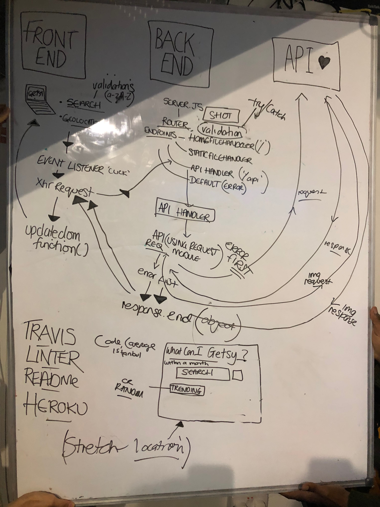

# GETSY

Team members Becky @rb50 Lex @devgrrrl Tunde @tundeaji1232 Johanna @johanna-hub

## Why?
Our task this week was to create an application

User Stories:

1) I want to search for a gift on ETSY which is under £10 which can be delivered within a couple of weeks.

2) I want to be able to switch the theme of my page between standard styling and a Christmas theme.

3) I want to be able to click on each item and to be taken to the relevant etsy listing.

4) If I try to input non alphanumeric characters into the search field,

